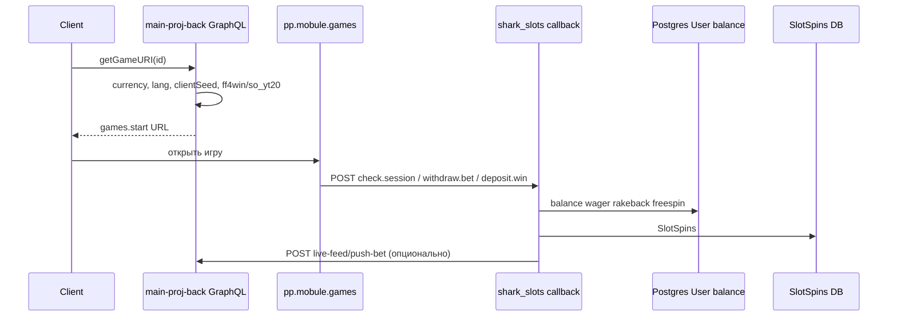
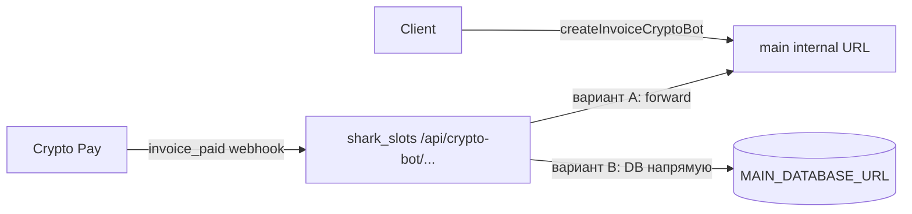
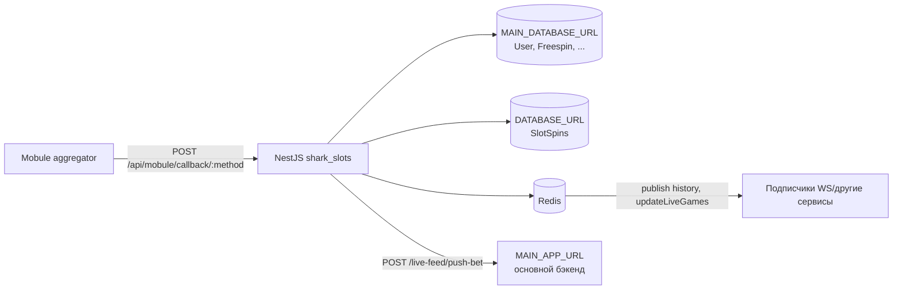

# shark_slots — контекст для AI-агента

Микросервис **callback-обработчика слотов Mobule** для игровой платформы (Hi Roll / Shark Slots).  
Репозиторий: https://github.com/againdev/shark_slots  
npm-пакет внутри: `hi_roll_slots` (имя папки `shark_slots` — другое, не путать).

---

## Назначение

**Два связанных проекта:**

| Проект | Где | Роль |
|--------|-----|------|
| **main-proj-back** | `main-proj-back/` (локальная копия, в `.gitignore`) | Основной бэкенд Shark: GraphQL, auth, платежи, каталог слотов, **запуск игры** |
| **shark_slots** (этот репо) | корень | **Вынесенный callback-сервер** на отдельном IP: Mobule + (план) Crypto Pay webhook |
| **hi_roll backend** (референс) | `fullstack/hi_roll/backend` | Полная реализация CryptoBot, если в `main-proj-back` модуля нет |

Пользователь открывает слот через GraphQL на main → Mobule шлёт webhook на **shark_slots** → shark_slots меняет `User.balance` в общей Postgres и пишет `SlotSpins` в отдельную БД.

shark_slots **не** поднимает GraphQL; целевой scope callback’ов: Mobule (готово), Crypto Pay deposit webhook (см. ниже).

---

## Основной проект (`main-proj-back`)

Локальная копия для ориентира (не в git shark_slots). При расхождении **источник правды — main-proj-back**, затем синхронизировать `prisma/main/schema.prisma` и `src/mobule/` в shark_slots.

### Стек main

NestJS 10 + **GraphQL (Apollo)** + Telegraf bot + Redis pub/sub + одна Prisma БД (`DATABASE_URL`). Модули: `User`, `Auth`, `Dice`, `Mines`, `Bonus`, `Withdraw`, `Mobule`, `Currency`, `Tournament`, `Support`, …

### Слоты Mobule в main (запуск игры)

Файлы: `main-proj-back/src/mobule/mobule.service.ts`, `mobule.resolver.ts`, `mobule.dto.ts`.

GraphQL:

- `getGames` — каталог `SlotsMobule` (пагинация 40, фильтры provider/search/isLive/onlyOnShark/sortBy).
- `getGameURI` (auth) — URL реальной игры.
- `getGameDemoURI` (optional auth) — демо.

Сборка URL (`BASE_URL = https://pp.mobule.games`):

```ts
// getGameURI — ключевая логика (актуальная)
const currency = user.currency ?? "EUR";
const lang = user.languageCode === "ru" ? "ru" : "en";
const partnerAlias = user.role === YOUTUBER ? "so_yt20" : "ff4win";
// partner.session === clientSeed (генерируется ensureApiToken при отсутствии)
params: partner.alias, partner.session, game.provider, game.alias,
         lang, lobby_url, currency, mobile, [freerounds_id]
// → https://pp.mobule.games/games.start?...
```

| Параметр | Откуда |
|----------|--------|
| `currency` | `User.currency` (enum `USD` \| `EUR` \| `UAH`), default `EUR` если null |
| `lang` | `ru` если `languageCode === "ru"`, иначе `en` |
| `partner.session` | `User.clientSeed` (12 hex, `randomBytes(6)` при первом запуске) |
| `partner.alias` | `so_yt20` для `YOUTUBER`, иначе **`ff4win`** |
| `lobby_url` | `APP_DOMAIN` из env |
| `mobile` | `deviceWidth <= deviceHeight` |

Демо: `games.demo`, alias всегда `ff4win`, `lang: "en"`, currency — из пользователя или `EUR`.

**Колбэков Mobule в main нет** — они только на shark_slots.

### Валюта на платформе

- `User.currency` — выбирается один раз: mutation `setUserCurrency` (`user.service.ts`), повторно сменить нельзя.
- `User.changeUserLanguage` → `languageCode`.
- `CurrencyService` — живые курсы USD/EUR/UAH в `CurrencyRate` (cron 5 мин, open.er-api.com). Используется для депозитов/выводов/турниров, **не для слотов Mobule напрямую**.
- Пороги бонусов/rakeback/турниров — `currency.constants.ts` (`nominalFromUsd`, `RAKEBACK_DEPOSIT_TIERS_BY_CURRENCY`, …).
- Сущности Mines/Dice/Deposit/Withdraw/Freespin/Tournament несут поле `currency` (миграция `20260428_add_currency_per_entity`).

Enum: `Currency { USD, EUR, UAH }`.

### Env main, связанные со слотами

| Переменная | Назначение |
|------------|------------|
| `SLOTS_DATABASE_URL` | Отдельная БД для истории спинов (аналог `DATABASE_URL` в shark_slots) |
| `SLOTS_SERVER_IP` | IP callback-сервера (для документации/фаервола; в коде mobule не читается) |
| `APP_DOMAIN` | `lobby_url` для Mobule |

В rate-limit guard исключён путь `/live-feed/push-bet` (ожидает POST от shark_slots); **контроллер live-feed в текущей копии main не найден** — возможно в другой ветке или ещё не перенесён.

### Схема main vs `prisma/main` в shark_slots

Main **новее**. Отличия, важные для синхронизации:

- В main: `User.currency`, KYC/phone/support, `OriginalGameBank`, нет **X50**, `Role.SUPPORT`, урезанные `PaymentSystem`, `TournamentType` только `GAME`.
- В shark_slots `prisma/main`: старая схема (есть X50, нет `User.currency` в schema — **дрифт**).
- Была попытка `mobulePartnerSession` → откат, снова только `clientSeed` для session.

### Поток данных (целевой)



### Crypto Bot / Crypto Pay (депозиты)

**В `main-proj-back` модуля `crypto-bot/` сейчас нет** (в `app.module` не импортирован), но в `app.config` есть env, в `rate-limit.guard` — путь `/crypto-bot/y825xaasdtq9ds4zacsfodra6me7qg`. Полный код: `fullstack/hi_roll/backend/src/crypto-bot/`.

#### Как устроено (hi_roll / legacy)

| Часть | Где | Что делает |
|-------|-----|------------|
| `createInvoiceCryptoBot` | main GraphQL | `POST {CRYPTO_BOT_API_URL}/createInvoice` с токеном, создаёт `Deposit` PENDING, `trackerId = invoice_id` |
| Webhook | `POST /crypto-bot/y825xaasdtq9ds4zacsfodra6me7qg` | `update_type === "invoice_paid"` → зачисление баланса |
| `createCheckCryptoBot` / `acceptCheckCryptoBot` | main GraphQL | вывод через Crypto Pay checks — **остаётся на main** |

`CRYPTO_BOT_CALLBACK_DEPOSIT_URL` в env — **для ручной настройки** URL в [@CryptoBot](https://t.me/CryptoBot) → Crypto Pay → Webhooks; в `createInvoice` URL **не передаётся**.

Обработчик `processCryptoBotDepositCalback` (упрощённо):

1. Парсит `payload.invoice_id`, `status`, `amount`.
2. Ищет `Deposit` по `trackerId`.
3. Идемпотентность: если уже `SUCCESS` — выход.
4. Обновляет deposit, `user.deposit`, `balance`, `wager` (welcome ×2 balance / ×30 wager при первом депозите).
5. `bonusService.updateDepositBonuses` (в Shark — no-op), `activateDepositOnlyPromocode`, реферал, `giveFreespinsForDeposit`, `botService.sendPaymentNotification`.

**Подпись webhook:** заголовок `crypto-pay-api-signature`; в hi_roll **не проверяется** — при переносе добавить HMAC-SHA256 (см. [Crypto Pay docs](https://help.crypt.bot/crypto-pay-api#verifying-webhook-updates)).

#### Перенос webhook на shark_slots (чтобы не менять URL в CryptoBot при бане main IP)

Цель: в Crypto Pay один раз указать URL **сервера shark_slots**, а не main.



**Вариант A — прокси (реализован в `src/crypto-bot/`)**

- `POST /api/crypto-bot/y825xaasdtq9ds4zacsfodra6me7qg` — проверка `crypto-pay-api-signature`, forward на main с `X-Internal-Webhook-Secret`.
- Env: `CRYPTO_BOT_API_TOKEN`, `INTERNAL_WEBHOOK_SECRET`, `MAIN_APP_URL` или `MAIN_CRYPTO_BOT_WEBHOOK_URL`.
- ТЗ для main: `docs/TZ-crypto-bot-main-backend.md`
- Чеклист .env / Crypto Pay UI: `docs/CRYPTO_BOT-setup-checklist.md`

**Вариант B — полный обработчик на shark_slots**

1. Перенести `processCryptoBotDepositCalback` + `MainPrismaService`.
2. Подтянуть зависимости: `BonusService`, `BotService`, `UserService.giveFreespinsForDeposit` — или заменить вызовом `POST main/internal/deposits/crypto-bot/complete` после записи в БД.
3. `createInvoice` / выводы **не переносить** — нужен `CRYPTO_BOT_API_TOKEN` только на main.
4. Синхронизировать логику с актуальным Shark (`bonus.service`, multi-currency на `Deposit`).

**Что оставить на main в любом случае**

- GraphQL: `createInvoiceCryptoBot`, `createCheckCryptoBot`, `acceptCheckCryptoBot`.
- `CRYPTO_BOT_API_URL`, `CRYPTO_BOT_API_TOKEN`.
- Nginx: location `/crypto-bot/` можно снять с main или оставить только для internal forward.

**Чеклист деплоя**

1. Поднять endpoint на shark_slots, `MOBULE_ALLOWED_IPS` / firewall — IP Crypto Pay (уточнить в документации).
2. SSL на домене slots-сервера.
3. Один раз сменить Webhook URL в Crypto Pay → slots URL (путь с секретным сегментом `y825...` лучше не менять).
4. Тест: тестовый инвойс → webhook → баланс в БД + уведомление в Telegram.
5. `MAIN_DATABASE_URL` на shark_slots — та же БД, что у main.

---

## Стек (shark_slots)

| Слой | Технология |
|------|------------|
| Framework | NestJS 10 |
| Runtime | Node.js, TypeScript (strictness ослаблен) |
| ORM | Prisma 6, **два отдельных клиента** |
| Cache / pub-sub | Redis 7 (`@liaoliaots/nestjs-redis`) |
| Auth (заготовка) | `@nestjs/jwt`, `TokenService`, `AuthGuard` — **не подключены к роутам** |
| Infra | **Prod:** `docker-compose.yml` (Postgres, Redis, Adminer, Nginx) + `docker-compose.backend.yml` (app). **Dev:** `docker-compose.dev.yml` (всё в одном) |

---

## Архитектура



### Две базы данных

| Prisma schema | Env | Сервис | Что хранит |
|---------------|-----|--------|------------|
| `prisma/main/schema.prisma` | `MAIN_DATABASE_URL` | `MainPrismaService` | Вся платформа: `User`, `Freespin`, игры X50/Mines/Dice, депозиты, турниры, каталог `SlotsMobule` |
| `prisma/local/schema.prisma` | `DATABASE_URL` | `LocalPrismaService` | Только `SlotSpins` — лог ставок/выигрышей по слотам |

Клиенты сгенерированы в `prisma/generated/main-client` и `prisma/generated/local-client` (уже в git).

Регенерация (если меняли schema):

```bash
npx prisma generate --schema prisma/main/schema.prisma
npx prisma generate --schema prisma/local/schema.prisma
```

`src/prisma.service.ts` — **legacy, не используется** в модулях.

---

## Структура каталогов

```
shark_slots/
├── main-proj-back/          # копия основного бэка (gitignore), см. раздел выше
├── AGENTS.md
├── src/
│   ├── main.ts              # bootstrap: CORS, cookie-parser, prefix api
│   ├── app.module.ts        # ConfigModule, Redis, MobuleModule
│   ├── app.config.ts        # валидация env (class-validator)
│   ├── app.controller.ts    # GET /api → Hello World
│   ├── main-prisma.service.ts
│   ├── local-prisma.service.ts
│   ├── mobule/              # ★ основная бизнес-логика
│   │   ├── mobule.module.ts
│   │   ├── mobule.controller.ts
│   │   ├── mobule.service.ts  # ~960 строк
│   │   └── mobule.dto.ts
│   ├── token/               # JWT helpers (не на роутах)
│   └── types.d.ts           # Express.Request.user
├── prisma/
│   ├── main/schema.prisma
│   ├── local/schema.prisma
│   └── generated/           # сгенерированные клиенты
├── docker-compose.yml           # prod stack 1: DB + Redis + Nginx
├── docker-compose.backend.yml   # prod stack 2: NestJS
├── docker-compose.dev.yml       # local all-in-one
├── deploy.sh                    # prod: оба стека
├── .env                     # не в git
└── test/                    # e2e шаблон Nest (устарел: ждёт GET / без prefix)
```

---

## HTTP API

Глобальный префикс: **`/api`** (см. `src/main.ts`).

| Метод | Путь | Описание |
|-------|------|----------|
| GET | `/api` | `Hello World!` (health) |
| POST | `/api/mobule/callback/:method` | Колбэк Mobule |

### Параметр `:method` → обработчик в `MobuleService.callback`

| method | Метод сервиса | Смысл |
|--------|---------------|-------|
| `check.session` | `checkSession` | Проверка сессии, отдача `id_player` и баланса |
| `check.balance` | `checkBalance` | Текущий баланс |
| `withdraw.bet` | `userBet` | Списание ставки |
| `deposit.win` | `userWin` | Зачисление выигрыша |
| `trx.cancel` | `trxCancel` | Заглушка → `{ status: 200 }` |
| `trx.complete` | `trxComplete` | Заглушка → `{ status: 200 }` |
| `freerounds.activate` | `freeroundsActivate` | Активация фриспинов |
| `freerounds.complete` | `freeroundsComplete` | Завершение фрираундов |
| `freerounds.step` | `freeroundsStep` | Заглушка → `true` |

Тело запроса: `SlotsCallbackRequestDto` — поля могут быть на верхнем уровне **или** в `body` (для `deposit.win` используется `data.body || data`).

Ответ: `SlotsCallbackResponseDto` — `{ status, method?, message?, response? }` (не Nest HTTP exceptions для бизнес-ошибок Mobule).

---

## Ключевая бизнес-логика (`mobule.service.ts`)

### Идентификация пользователя

- **`data.session` === `User.clientSeed`** в main DB (= `partner.session` при `games.start` в main).
- Суммы от Mobule в **минорных единицах валюты** (копейки/центы) → делить на `100` для `Decimal`/`balance`.

### Валюта (синхронизировано с main)

- `User.currency ?? EUR` — ожидаемая валюта; `data.currency` из Mobule **должна совпадать**.
- Ответы: `response.currency` + баланс в минорных единицах (×100).
- Rakeback: `src/currency/currency.constants.ts` + `mobule.helpers.ts` — база 0.25% + тиры депозита по валюте (`RAKEBACK_DEPOSIT_TIERS_BY_CURRENCY`), начисление ×0.06 (как `user.service` в main). Периодические бонусы day/week/month **убраны**.
- partner.alias: YOUTUBER → `so_yt20`, остальные → `ff4win` (и другие кроме `so_yt20`).
- `MOBULE_ALLOWED_IPS` в env (через запятую); убран `redis.flushdb()` при старте.

### Безопасность входящих запросов

- **IP whitelist**: `allowedIps = ['188.166.21.18']` — сверить с `SLOTS_SERVER_IP` / IP Mobule в проде.
- IP берётся из `x-forwarded-for` или `remoteAddress`.
- `MOBULE_SECRET_TOKEN` в конфиге **объявлен, но подпись `sign` в коде не проверяется**.
- Много `console.log` в прод-пути.

### Роли и partner.alias

- Роль `YOUTUBER` → в `check.session` обязателен `partner.alias === 'so_yt20'`; для остальных — этот alias **запрещён**.
- При bet/win для YOUTUBER агрегатор в логах — `'so_yt20'`.
- В main для обычных пользователей при старте игры передаётся **`ff4win`** — callback должен это допускать (сейчас явно не валидируется, кроме запрета `so_yt20`).

### Конкурентность

- На каждый `session` (clientSeed) — **`async-mutex` Mutex** в `sessionMutexMap` для `withdraw.bet`, `deposit.win`, freerounds.

### Ставка (`userBet`)

1. Проверка баланса, decrement `balance`, decrement `wager`, increment `betSum`, `games`.
2. Rakeback: `calculateUserRakeBack(user)` → процент от депозита и бонусных дат; начисление в `rakeBackBalance` / `totalRakeBackAmount` (×0.06).
3. Запись в local `SlotSpins` (`type: 'bet'`).
4. Redis: ключ `user.{userId}.historyBalance` — JSON-массив истории.

### Выигрыш (`userWin`)

1. Increment `balance`, `winSum`, rakeback, `topWin`.
2. Local `SlotSpins` (`type: 'win'`).
3. Redis: тот же history; при win > $1:
   - `publish('history', ...)`
   - `publish('updateLiveGames', ...)`
   - ключ `games` — последние 10 крупных выигрышей
4. `axios.post` → `{MAIN_APP_URL}/live-feed/push-bet`

### Фриспины

- Модель `Freespin` в main DB: `status` 0 → 1 (activate) → 2 (complete).
- `freerounds.complete`: начисление `total_win`, wager ×10 если `isPromo`.

### Redis при старте ⚠️

`onModuleInit()` вызывает **`redis.flushdb()`** — очищает **всю** текущую DB Redis. Осторожно в shared/dev окружениях.

---

## Переменные окружения

Валидируются в `AppConfig` (`src/app.config.ts`). Файл `.env` в корне (в git нет).

| Переменная | Назначение |
|------------|------------|
| `NODE_ENV` | окружение |
| `APP_ADDRESS` | bind host |
| `APP_PORT` | порт HTTP |
| `CORS_ORIGIN` | через запятую |
| `CORS_CREDENTIALS` | boolean |
| `CORS_ALLOWED_HEADERS` | через запятую |
| `CORS_METHODS` | через запятую |
| `DATABASE_URL` | local Prisma → `SlotSpins` |
| `MAIN_DATABASE_URL` | main Prisma → платформа |
| `REDIS_HOST` | default `127.0.0.1` |
| `REDIS_PORT` | default `6380` (docker maps 6380→6379) |
| `ACCESS_TOKEN_SECRET` | JWT (не на mobule routes) |
| `REFRESH_TOKEN_SECRET` | JWT |
| `EXPIRES_IN_ACCESS_TOKEN` | JWT |
| `EXPIRES_IN_REFRESH_TOKEN` | JWT |
| `MOBULE_SECRET_TOKEN` | задуман для Mobule (не используется в проверке) |
| `MAIN_APP_URL` | URL основного API для live-feed |

`app.config` требует `DATABASE_URL`, но local schema использует ту же переменную — **две разные строки подключения задаются разными env-именами**: `MAIN_DATABASE_URL` vs `DATABASE_URL`.

---

## Redis: ключи и каналы

| Ключ / канал | Назначение |
|--------------|------------|
| `user.{userId}.historyBalance` | JSON-массив изменений баланса (RU labels) |
| `games` | Последние ~10 крупных выигрышей в слотах |
| pub/sub `history` | Событие для ленты выигрышей |
| pub/sub `updateLiveGames` | Обновление live-игр |

---

## Main DB: модели, важные для этого сервиса

Полная схема: `prisma/main/schema.prisma`.

| Модель | Использование в shark_slots |
|--------|----------------------------|
| `User` | balance, wager, betSum, winSum, rakeback, role, clientSeed, photoUrl, firstName, deposit; в main ещё **`currency`**, `languageCode` — в callback пока не читаются |
| `Freespin` | freerounds activate/complete |
| `SlotsMobule` | каталог игр (в сервисе пока не читается) |
| Остальное (X50, Mines, Dice, Deposit, …) | в схеме есть, **этот сервис не трогает** |

Local DB:

| Модель | Поля |
|--------|------|
| `SlotSpins` | userId, gameId, type (`bet`/`win`), value, transactionId, gameToken, agregator |

---

## Локальная разработка

```bash
npm install
npm run compose:dev           # Postgres :5434, Redis :6380, app :4001, nginx :80
# или только БД: docker compose -f docker-compose.dev.yml up postgres redis -d
# заполнить .env (оба DATABASE_URL, MAIN_DATABASE_URL, Redis, MAIN_APP_URL, ...)
npm run start:dev             # watch mode (без Docker app)
```

Сборка: `npm run build` → `npm run start:prod` (`node dist/main`).

## Прод-деплой (как fullstack/shark)

Два отдельных Docker Compose-стека на сервере `slotsidback.fun`:

| Стек | Файл | Контейнеры |
|------|------|------------|
| 1 | `docker-compose.yml` | `slots-postgres`, `slots-redis`, `slots-adminer`, `slots-nginx` (host network, `nginx/slots.conf`, Let's Encrypt) |
| 2 | `docker-compose.backend.yml` | `slots-backend` → `127.0.0.1:4001` |

```bash
./deploy.sh
# или:
npm run compose:infra && npm run compose:backend
```

В `.env` на сервере: `MAIN_DATABASE_URL` — БД основного Shark (часто удалённый хост); `DATABASE_URL` в контейнере **переопределяется** compose на `slots-postgres`. `REDIS_HOST` → `slots-redis`. Nginx проксирует HTTPS на `127.0.0.1:4001` (см. `nginx/slots.conf`).

Опционально `NGINX_CONF=./nginx/slots.dev.conf` для теста без SSL.

Тесты: `npm test`, `npm run test:e2e` — e2e ожидает `GET /` без `/api`, тест **сломан относительно текущего bootstrap**.

---

## Модули NestJS

```
AppModule
├── ConfigModule (global, validateAppConfig)
├── RedisModule (url из REDIS_HOST:REDIS_PORT)
├── MobuleModule
│   ├── MobuleController
│   └── MobuleService + MainPrismaService + LocalPrismaService + JwtService
├── AppController / AppService
└── TokenService (provider, без TokenModule import)
```

`TokenModule` и `AuthGuard` **не импортированы** в `AppModule` / `MobuleModule`.

---

## Типичные задачи → куда смотреть

| Задача | Файл |
|--------|------|
| Логика запуска слота / URL / валюта / язык | `main-proj-back/src/mobule/mobule.service.ts` |
| Смена валюты пользователя | `main-proj-back/src/user/user.service.ts` → `setUserCurrency` |
| Курсы и константы по валютам | `main-proj-back/src/currency/` |
| Новый метод Mobule (callback) | `src/mobule/mobule.service.ts` switch + private method |
| Синхронизация схемы БД | `main-proj-back/prisma/schema.prisma` → `prisma/main/schema.prisma` + generate |
| Изменить логику ставки/выигрыша | `userBet`, `userWin` |
| Правила фриспинов | `freeroundsActivate`, `freeroundsComplete` |
| IP / безопасность колбэков | `allowedIps`, добавить verify sign |
| Новое поле env | `app.config.ts` + `.env` |
| Схема БД | `prisma/main` или `prisma/local` + regenerate |
| CORS / порт | `main.ts`, env |
| Redis-поведение | `mobule.service.ts`, осторожно с `flushdb` |

---

## Известные особенности / техдолг

1. **`redis.flushdb()` при каждом старте** — может ломать соседние сервисы на том же Redis.
2. **Подпись Mobule не проверяется** — только IP.
3. **`check.session` при ошибке в catch** может вернуть `undefined` вместо DTO.
4. **Вложенные `$transaction`** main + local — не атомарны между двумя БД.
5. **Имя пакета** `hi_roll_slots` vs репо `shark_slots`.
6. **`PrismaService`**, **`TokenModule`** — мёртвый код.
7. **README** — шаблон NestJS, не описывает проект.
8. **Сгенерированные Prisma binary targets** в git — большой репозиторий; при деплое на Linux нужны `linux-musl`, `debian-openssl-3.0.x`.
9. **docker-compose** содержит захардкоженные креды Postgres — только для local dev.
10. Много **console.log** вместо Nest Logger.
11. **`prisma/main/schema.prisma`** может отставать от полной схемы main (добавлены `currency`, убраны поля period-rakeback из User).
12. **`main-proj-back/`** исключён из `tsconfig.build.json`.
13. **`main-proj-back/`** не в git — при обновлении main копировать сюда или обновлять AGENTS.md вручную.

---

## Соглашения кода

- Импорты с алиасом `src/...` (baseUrl в tsconfig).
- `strictNullChecks: false`, `noImplicitAny: false`.
- Ответы Mobule — HTTP 200 с `status` в JSON (4xx/5xx внутри тела).
- Деньги: Prisma `Decimal`, сравнения через `Number()` или `Decimal` из `@prisma/client/runtime/library`.
- Язык сообщений об ошибках для Mobule: **русский** в ряде мест.

---

## Чего в проекте нет

- Swagger / OpenAPI
- CI/CD конфигов
- Миграций Prisma в репо (только schema)
- Очередей (Bull и т.д.)
- Пользовательских REST-эндпоинтов кроме Mobule callback и hello

При изменениях **не расширять scope** без запроса: сервис намеренно узкий (callback-адаптер Mobule).
